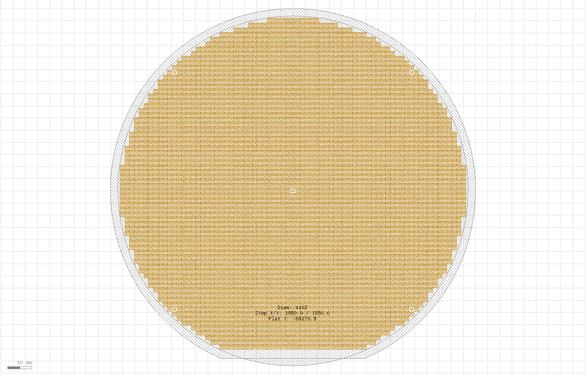
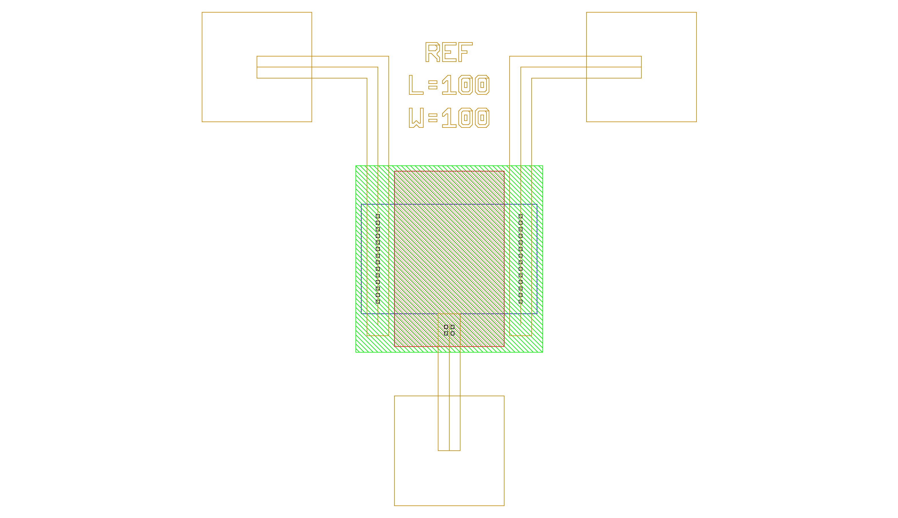
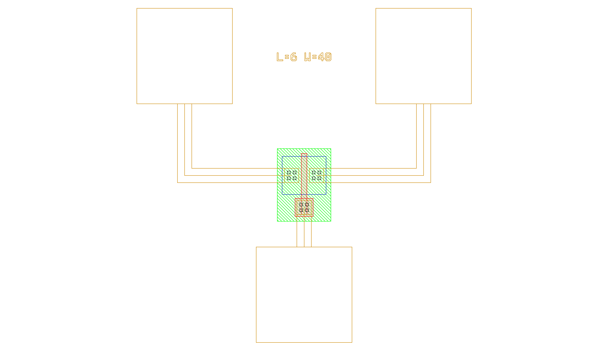

# MOSFET Fabrication & Process Design
This repository contains the design files, process flow documentation, and TCAD simulations for the fabrication of N-channel enhancement-mode MOSFETs. The project integrates physical process planning with automated layout generation for Maskless Lithography (MLA).





## Project Components
* Process Flow: Detailed fabrication steps documented in LaTeX.
* Layout Automation: KLayout LYM macros for generating GDSII files.
* TCAD Simulations: Predictive modeling using Silvaco ATHENA (Upcoming).
    
## Process Overview
The fabrication follows a standard self-aligned gate process. The specific parameters for oxidation, implantation, and metallization are detailed in the process flow document.

## Software & Automation
### KLayout Macro (LYM)
The layout is generated programmatically to ensure precision and scalability. The .lym script handles:
* Layer Definition: Active, Gate, Contact, and Metal layers.
* Parametric Design: Ability to adjust W/L ratios dynamically.
* GDS Export: Optimized for direct import into MLA systems.
To run the macro:
1) Open KLayout.
2) Go to Macros -> Macro Development.
3) Import mosfet_array.lym and click Run.
4) Import mosfet_array_wafer.lym and click Run.
5) Inspect nmos_array_wafer.gds

### TCAD Simulation (Silvaco ATHENA)
Status: In Development Future updates will include .in files to simulate:
1) Dopant concentration profiles (NA​, ND​).
2) Junction depths.
3) Threshold voltage (Vth​) extraction.

## Repository Structure
```
├── layout/                    # KLayout Python macros and GDSII outputs
│   ├── layout_helper.py
│   ├── nmos_array.lym         # Source Macro: Generates the parametric 4x4 NMOS block (L/W variations)
│   ├── nmos_reference.lym     # Source Macro: Generates the fat FET block (reference geometry)
│   ├── nmos_wafer.lym         # Assembly Macro: Tiles the die onto a 150mm wafer with flat & labels
│   └── nmos_wafer.lyp         # Layer Properties: Defines layer names (Metal, Poly) and colors for KLayout
├── simulation/                # (Future) Silvaco ATHENA/ATLAS TCAD input scripts
├── process/                   # (Future) Process workflow document
├── LICENSE
└── README.md
```

## Getting Started
* Documentation: Compile the LaTeX file in the docs/ folder to view the full process traveler.
* Layout: Load the script in KLayout to generate your device geometry.
* Fabrication: Use the exported GDSII file with your MLA 150 (or equivalent) lithography system.

## License
See the [LICENSE](./LICENSE) file for details.
